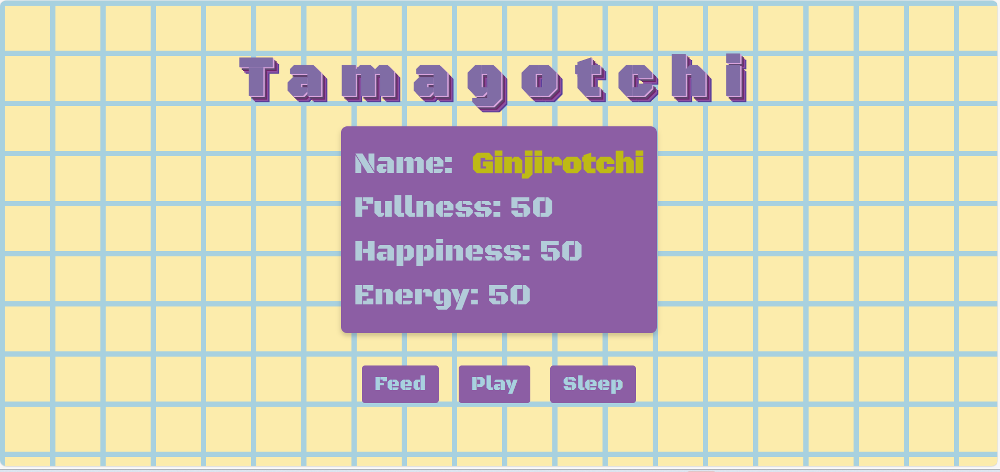

### Final Ticket - REAL-WORLD EXAMPLE: TAMAGOTCHI GAME

Unfortunately, Keith from accounts is allergic to dogs  so the office can't have animals in to boost morale. Your company has asked you to increase the happiness of staff by creating a virtual pet that everyone can play with in the office. Tamagotchi is a virtual pet simulation game.

# Tamagotchi Game

This is a simple Tamagotchi game implemented using HTML, CSS, and JavaScript. The game allows you to interact with a virtual pet by feeding, playing, and putting it to sleep. The goal is to keep the pet alive by maintaining its fullness 🥣🥘, happiness 💗💓😍, and energy levels⚡✨.

## Tasks:

Create an object (representing the Tamagotchi virtual pet) that has the properties name, fullness, happiness and energy and assign values to each property (the company suggests assigning a number between 1 and 100 to each hunger, happiness and energy)

Use prompt to get user input and allow staff to name the office pet and modify the object to reflect the name the pet has been given.

Loop while the pet is alive (using the criteria below):

When the fullness becomes greater than 100, the pet dies (due to overfeeding).
When any of the fullness, energy or happiness become less than or equal to 0, the pet dies (due to underfeeding, or no more energy or sadness respectively).

Inside the loop:

Log the pet's current stats to the console. The company wants the pet to "interact" with the user in the console. Your team can decide how to implement this, for example:

If fullness is low, log a hungry emoji and message
If happiness is high, log a happy emoji and message
If energy is low, log a tired emoji and message

Get creative with different emoji and messages based on the pet's needs to make it seem interactive in the console! This brings the virtual pet to life.

Use prompt to get user input and ask for either 1, 2 or 3 to ben entered. (The numbers relate to the actions in the table below):

Input	Action
1	Feed
2	Play
3	Sleep

When the input is "1" (in other words, the selected action is feed), increment the pet's fullness by 10

When the input is "2" (in other words, the selected action is play), decrement the pet's fullness and energy by 20 and increment happiness by 20.

When the input is "3" (in other words, the selected action sleep), decrement the pet's fullness by 10 and increment the energy by 20.

When the pet has died, log a message to the console to let the user know.

# Stretch goal #1: 

Handle the scenario where the user's input isn't valid (in other words, isn't 1, 2 or 3).

# Stretch goal #2: 

As an additional challenge, you could add custom methods to the Tamagotchi object that handle each action like feeding, playing and sleeping. Then instead of directly changing the Tamagotchi properties in the loop, call these new methods that will update the object for you.
